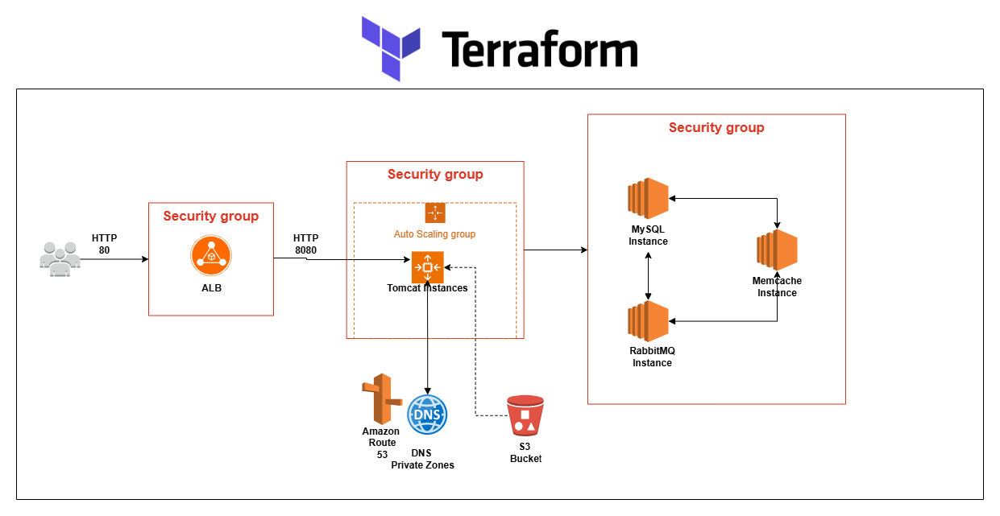

# Terraform AWS Lift & Shift App

This project demonstrates how to deploy a Java-based monolithic application (vProfile) using a Lift-and-Shift strategy on AWS. The infrastructure is defined using Terraform and includes EC2 instances, an Application Load Balancer, Auto Scaling Groups, IAM roles, and Route53 for DNS.

## 📌 Project Overview

The main goal is to replicate a traditional on-premise deployment into AWS using Infrastructure as Code (IaC). The application is built using Maven and manually uploaded to S3 to be deployed on the EC2 instance managed by an Auto Scaling Group.

## 📷 Architecture Diagram




## 🗂️ Project Structure

```
|-- ami.tf
|-- architecture/
|   `-- terraform_aws_lift_shift_app.drawio.png
|-- asg.tf
|-- backend.tf
|-- data.tf
|-- ec2.tf
|-- iamrole.tf
|-- keypairs.tf
|-- launchtemplate.tf
|-- loadbalancer.tf
|-- main-app/
|   |-- README.md
|   `-- vprofile-project/
|-- providers.tf
|-- route53.tf
|-- scripts/
|   |-- memcache.sh
|   |-- mysql.sh
|   |-- rabbitmq.sh
|   `-- tomcat.sh
|-- secgroups.tf
|-- terraform.tfvars
|-- variables.tf
|-- vprofile-app-key
|-- vprofile-app-key.pub
|-- vprofile-backend-key
`-- vprofile-backend-key.pub
```

## 🧰 Requirements

- AWS Account
- Terraform CLI >= 1.0
- AWS CLI configured
- Git
- Maven
- SSH key pair

## 🚀 Deployment Instructions

1. **Clone the Repository**  
   Clone this repository to your local machine:

   ```bash
   git clone https://github.com/Roberto-1998/terraform_aws_lift_shift_app.git
   cd terraform_aws_lift_shift_app
   ```

2. **Initialize Terraform**  
   ```bash
   terraform init
   ```

3. **Check & Apply the Terraform Plan**  
   ```bash
   terraform plan
   terraform apply
   ```

4. **Build the Application Artifact**  
   Inside `main-app/`:

   ```bash
   git clone https://github.com/your-org/vprofile-project.git
   cd vprofile-project
   mvn install
   ```

   This will create the `vprofile-v2.war` file inside the `target/` directory.

5. **Upload Artifact to S3**  
   ```bash
   aws s3 cp target/vprofile-v2.war s3://<your-bucket-name>/artifact/
   ```

6. **Connect to the EC2 Instance and Deploy the App**  
   ```bash
   ssh -i vprofile-app-key.pem ubuntu@<private-ip-of-app-instance>
   sudo -i
   snap install aws-cli --classic
   aws s3 cp s3://<your-bucket-name>/artifact/vprofile-v2.war /tmp/
   systemctl stop tomcat10
   rm -rf /var/lib/tomcat10/webapps/ROOT
   cp /tmp/vprofile-v2.war /var/lib/tomcat10/webapps/ROOT.war
   systemctl start tomcat10
   ```

## 🔐 Security

Ensure that your key pairs are secured and not uploaded to any public repositories.

## 📄 License

This project is licensed under the MIT License.

## AWS Services Used

This project leverages several AWS services to build a scalable and production-ready lift-and-shift architecture:

- **Amazon EC2**: Hosts application and backend instances.
- **Amazon S3**: Stores the application artifact for later deployment.
- **Amazon Route 53**: Provides DNS services, including a private hosted zone for internal routing.
- **Elastic Load Balancer (ALB)**: Distributes traffic among the application instances.
- **Auto Scaling Group (ASG)**: Ensures high availability and scalability of the application.
- **IAM (Identity and Access Management)**: Manages permissions and roles for EC2 instances and S3 access.
- **Launch Template**: Standardizes instance configuration for the ASG.
